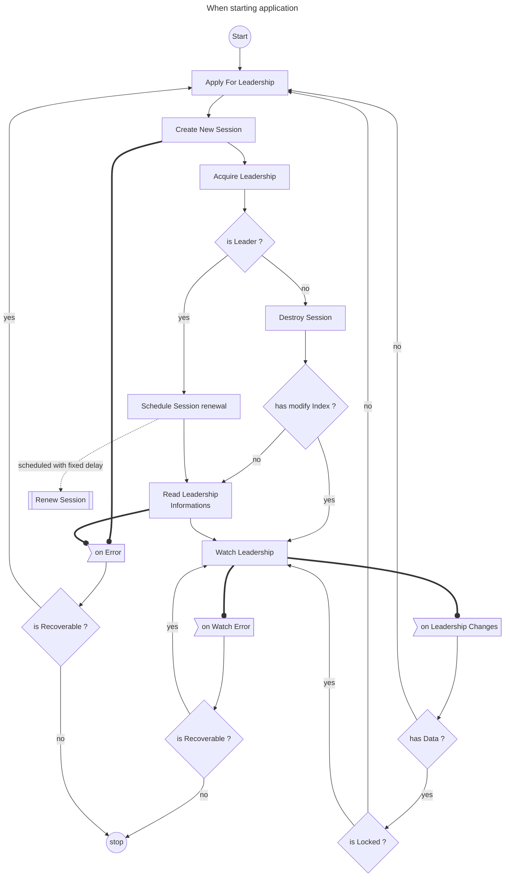
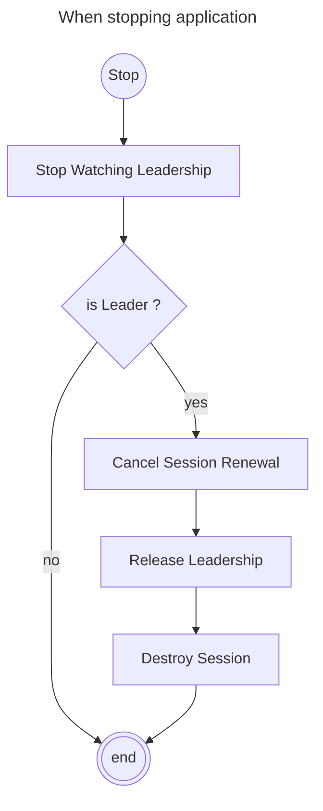

[](https://sonarcloud.io/summary/new_code?id=FrogDevelopment_micronaut-consul-leadership-election)

[](https://packagist.org/packages/FrogDevelopment/micronaut-consul-leadership-election)

# Micronaut Consul Leadership Election

A Micronaut library that provides distributed leadership election capabilities **across multiple clusters** using
HashiCorp Consul.
This library enables multiple instances of an application deployed among multiple clusters to coordinate and elect a
single leader, ensuring that only one instance
performs critical operations at any given time.

> :warning: If you need Leader Election in a **single cluster**, you may instead directly
> use [Micronaut Kubernetes](https://micronaut-projects.github.io/micronaut-kubernetes/latest/guide/) Leader Election
> feature.

## Features

- **Distributed Leadership Election**: Coordinate leadership among multiple application instances using Consul's
  session-based locking mechanism
- **Automatic Session Management**: Handles Consul session creation, renewal, and cleanup automatically
- **Reactive Programming**: Built on reactive principles using Project Reactor for non-blocking operations
- **Configurable Behavior**: Extensive configuration options for session TTL, lock delays, retry logic, and timeouts
- **Error Recovery**: Robust error handling with automatic retry and failover capabilities
- **Leadership Monitoring**: Watch for leadership changes and react accordingly
- **Management Endpoint**: Built-in `/leadership` endpoint for monitoring leadership status
- **Event-Driven Architecture**: Publish leadership change events for reactive application behavior
- **Comprehensive Documentation**: Fully documented API with detailed JavaDoc for all public classes and methods
- **Graceful Shutdown**: Properly releases leadership and cleans up resources during application shutdown
- **Pod label update**: Pod label updated according to current leadership status, toggleable and configurable

## Requirements

- Java 21 or higher
- [Micronaut Framework](https://micronaut.io/) 4.x
- [HashiCorp Consul](https://developer.hashicorp.com/consul) server

## Installation

Add the dependency to your `build.gradle` (Gradle) or `pom.xml` (Maven):

### Gradle

```kotlin
implementation("com.frogdevelopment.micronaut.consul:leadership-election:1.0.0-SNAPSHOT")
```

### Maven

```xml

<dependency>
    <groupId>com.frogdevelopment.micronaut.consul</groupId>
    <artifactId>leadership-election</artifactId>
    <version>1.0.0-SNAPSHOT</version>
</dependency>
```

## Configuration

| Property                                           | Type     | Default                                    | Description                                                                 |
|----------------------------------------------------|----------|--------------------------------------------|-----------------------------------------------------------------------------|
| `consul.leadership.enabled`                        | Boolean  | `true`                                     | Enable/disable the leadership election feature                              |
| `consul.leadership.token`                          | String   | -                                          | Consul ACL token for authentication with necessary permissions              |
| `consul.leadership.path`                           | String   | `leadership/${micronaut.application.name}` | Consul KV path for leadership coordination                                  |
| `consul.leadership.election.session-lock-delay`    | String   | `5s`                                       | Time before a session can acquire a lock after previous session destruction |
| `consul.leadership.election.session-ttl`           | String   | `15s`                                      | Session time-to-live duration                                               |
| `consul.leadership.election.session-renewal-delay` | Duration | `10s`                                      | Frequency of session renewal attempts                                       |
| `consul.leadership.election.max-retry-attempts`    | Integer  | `3`                                        | Maximum number of retry attempts for operations                             |
| `consul.leadership.election.retry-delay-ms`        | Integer  | `500`                                      | Delay between retry attempts in milliseconds                                |
| `consul.leadership.election.timeout-ms`            | Integer  | `3000`                                     | Timeout for Consul operations in milliseconds                               |
| `consul.leadership.pod-label.enabled`              | Boolean  | `true`                                     | Enable/disable pod label update with leadership status                      |
| `consul.leadership.pod-label.key`                  | String   | `leadership-status`                        | Customize pod label key                                                     |
| `consul.leadership.pod-label.label-for-leader`     | String   | `leader`                                   | Customize pod label value in case of leader                                 |
| `consul.leadership.pod-label.label-for-follower`   | String   | `follower`                                 | Customize pod label value in case of not leader                             |

### Kubernetes RBAC for Pod Label Updates

When pod label updates are enabled, the service account needs permissions to patch pods:

```yaml
apiVersion: rbac.authorization.k8s.io/v1
kind: Role
metadata:
  name: leadership-pod-updater
rules:
  - apiGroups: [ "" ]
    resources: [ "pods" ]
    verbs: [ "patch" ]
```

## Usage

### Basic Usage

The leadership election starts automatically when the application context is initialized. You can inject the
`LeadershipStatus` service to check leadership status:

```java
import com.frogdevelopment.micronaut.consul.leadership.status.LeadershipStatus;

import jakarta.inject.Inject;
import jakarta.inject.Singleton;

@Singleton
public class MyService {

    @Inject
    private LeadershipStatus leadershipStatus;

    public void performCriticalOperation() {
        if (leadershipStatus.isLeader()) {
            // This code will only execute on the leader instance
            System.out.println("I am the leader, performing critical operations...");
            // Your critical business logic here
        } else {
            System.out.println("I am not the leader, skipping critical operations.");
        }
    }
}
```

or listen to leadership change events.

### Leadership Events

The library publishes two types of events that you can listen to:

#### LeadershipChangeEvent

Fired when this instance's leadership status changes (acquires or loses leadership):

```java
import com.frogdevelopment.micronaut.consul.leadership.event.LeadershipChangeEvent;

import io.micronaut.runtime.event.annotation.EventListener;

@EventListener
public void onLeadershipChange(final LeadershipChangeEvent event) {
    final boolean isLeader = event.isLeader();
    // React to leadership status change
}
```

#### LeadershipDetailsChangeEvent

Fired when the current leader's details changes (new leader elected or leader metadata updated):

```java
import com.frogdevelopment.micronaut.consul.leadership.event.LeadershipDetailsChangeEvent;
import com.frogdevelopment.micronaut.consul.leadership.client.LeadershipInfo;

import io.micronaut.runtime.event.annotation.EventListener;

@EventListener
public void onLeadershipInfoDetailsChange(final LeadershipDetailsChangeEvent event) {
    final LeadershipDetails details = event.leadershipDetails();
    // Access leader details like pod name, namespace,  cluster name, timestamps, etc.
}
```

### Management Endpoint

The library provides a management endpoint at `/leadership` that exposes the current leadership status:

```bash
curl http://localhost:8080/leadership
```

Response example:

```json
{
  "isLeader": true,
  "details": {
    "podName": "app-instance-1",
    "namespace": "production-environment",
    "clusterName": "production-cluster",
    "acquireDateTime": "2025-10-18T22:45:30"
  }
}
```

This endpoint is useful for:

- Health checks and monitoring
- Load balancer routing decisions
- Operational dashboards
- External system integration

### Custom Leadership Details Provider

Customize the information stored in Consul during leadership operations:

```java
import com.frogdevelopment.micronaut.consul.leadership.details.LeadershipDetails;
import com.frogdevelopment.micronaut.consul.leadership.details.LeadershipDetailsProvider;

import jakarta.inject.Singleton;

@Singleton
public class CustomLeadershipDetailsProvider implements LeadershipDetailsProvider {

    @Override
    public LeadershipDetails getLeadershipInfo(final boolean isAcquire) {
        return MyLeadershipDetails.builder()
                .hostname("my-custom-hostname")
                .provider("GCP")
                .build();
    }
}
```

## How It Works

The leadership election process follows this workflow:

### Leadership Acquisition Flow



### Leadership Release Flow



## Best Practices

1. **Session TTL Configuration**: Set the session TTL shorter than your application's expected downtime to ensure quick
   leader failover
2. **Renewal Frequency**: Configure session renewal to occur at least 3 times within the session TTL period
3. **Lock Delay**: Use appropriate lock delay to prevent rapid leadership changes during network partitions
4. **Error Handling**: Implement proper error handling in your leadership-dependent code

## Troubleshooting

### Common Issues

1. **Leadership not acquired**: Check Consul connectivity and ACL permissions
2. **Frequent leadership changes**: Review network stability and session TTL configuration
3. **Sessions not renewed**: Verify task scheduler configuration and network connectivity

### Logging

Enable debug logging to troubleshoot issues:

```yaml
logger:
  levels:
    com.frogdevelopment.micronaut.consul.leadership: DEBUG
```

## Contributing

Contributions are welcome! Please read the contributing guidelines and submit pull requests to the repository.

## License

This project is licensed under the MIT License - see the LICENSE file for details.


