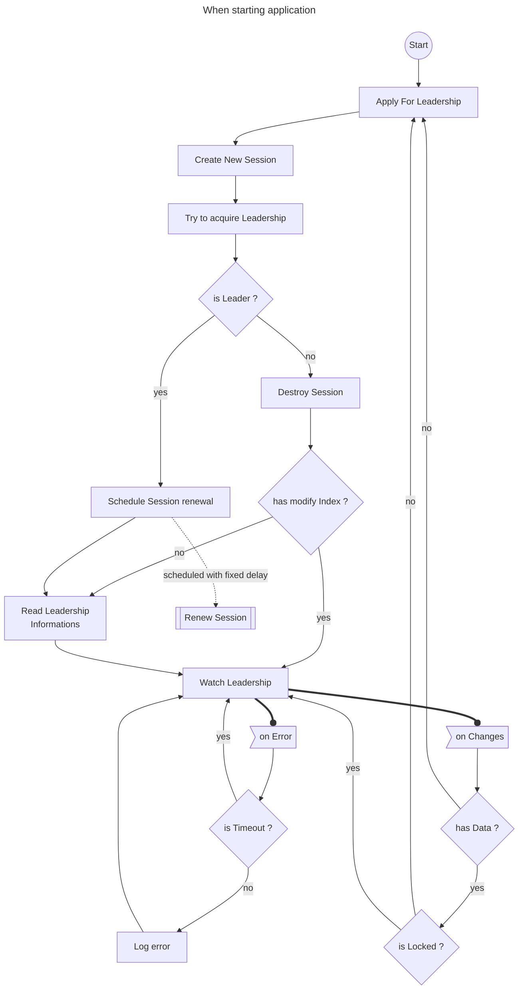
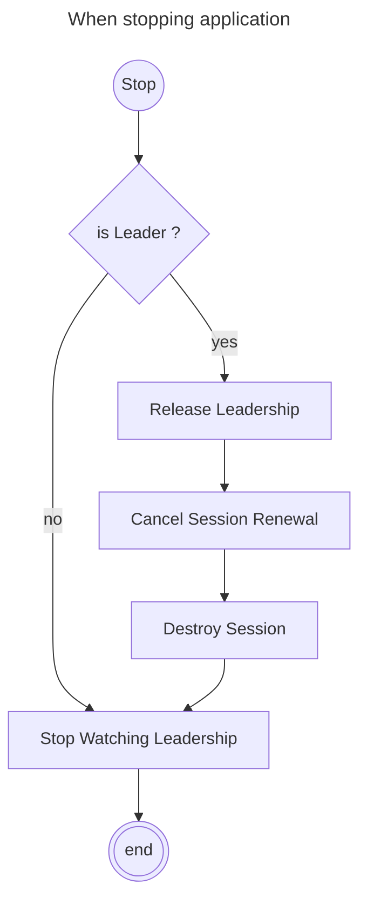

# Micronaut Consul Leadership Election

```mermaid
---
title: When starting application
---
flowchart TB
;
    start((Start)) --> applyForLeadership[Apply For Leadership]
    applyForLeadership --> createNewSession[Create New Session]
    createNewSession --> acquireLeadership[Try to acquire Leadership]
    acquireLeadership --> acquireLeadership_result
    acquireLeadership_result{is Leader ?} -- " yes " --> scheduleSessionRenewal
    acquireLeadership_result -- " no " --> destroySession[Destroy Session]
    destroySession --> hasModifyIndex{has modify Index ?}
    hasModifyIndex -- " yes " --> watchForLeadership[Watch Leadership]
    hasModifyIndex -- " no " --> readLeadershipInfo[Read Leadership\nInformations]
    scheduleSessionRenewal --> readLeadershipInfo
    readLeadershipInfo --> watchForLeadership
    scheduleSessionRenewal[Schedule Session renewal] -. scheduled with fixed delay .-> renewSession[[Renew Session]]
    watchForLeadership ==o onLeadershipChanges>on Changes]
    watchForLeadership ==o onWatchError>on Error] --> isTimeout{is Timeout ?}
    isTimeout -- " yes " --> watchForLeadership
    isTimeout -- " no " --> log[Log error] --> watchForLeadership
    onLeadershipChanges --> hasData{has Data ?}
    hasData -- " no " --> applyForLeadership
    hasData -- " yes " --> isLockPresent{is Locked ?}
    isLockPresent -- " no " --> applyForLeadership
    isLockPresent -- " yes " --> watchForLeadership
```

```mermaid
---
title: When stopping application
---
flowchart TB
;
    stop((Stop)) --> isLeader{is Leader ?}
    isLeader -- " no " --> stopWatching[Stop Watching Leadership]
    isLeader -- " yes " --> releaseLeadership[Release Leadership]
    releaseLeadership --> cancelSessionRenewal[Cancel Session Renewal]
    cancelSessionRenewal --> destroySession[Destroy Session]
    destroySession --> stopWatching
    stopWatching --> x(((end)))
```

