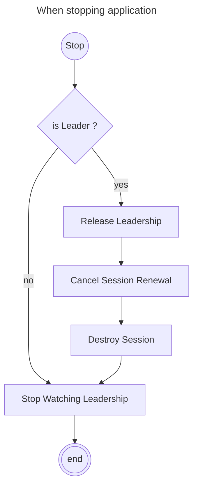

# Micronaut Consul Leadership Election

A Micronaut library that provides distributed leadership election capabilities using HashiCorp Consul. This library
enables multiple instances of an application to coordinate and elect a single leader, ensuring that only one instance
performs critical operations at any given time.

## Features

- **Distributed Leadership Election**: Coordinate leadership among multiple application instances using Consul's
  session-based locking mechanism
- **Automatic Session Management**: Handles Consul session creation, renewal, and cleanup automatically
- **Reactive Programming**: Built on reactive principles using Project Reactor for non-blocking operations
- **Configurable Behavior**: Extensive configuration options for session TTL, lock delays, retry logic, and timeouts
- **Error Recovery**: Robust error handling with automatic retry and failover capabilities
- **Leadership Monitoring**: Watch for leadership changes and react accordingly
- **Graceful Shutdown**: Properly releases leadership and cleans up resources during application shutdown

## Requirements

- Java 21 or higher
- Micronaut Framework 4.x
- HashiCorp Consul server
- Reactive Streams support (Project Reactor)

## Installation

Add the dependency to your `build.gradle` (Gradle) or `pom.xml` (Maven):

### Gradle

```groovy
implementation 'micronaut.consul.leadership.election:lib:1.0.0-SNAPSHOT'
```

### Maven

```xml

<dependency>
    <groupId>micronaut.consul.leadership.election</groupId>
    <artifactId>lib</artifactId>
    <version>1.0.0-SNAPSHOT</version>
</dependency>
```

## Configuration

Configure the leadership election in your `application.yml`:

```yaml
consul:
  leadership:
    enabled: true                    # Enable leadership election
    token: "your-consul-token"       # Optional: Consul ACL token
    path: "leadership/my-app"        # Consul KV path for leadership coordination
    election:
      enabled: true                  # Enable election process
      session-lock-delay: "5s"       # Lock delay after session destruction
      session-ttl: "15s"             # Session time-to-live
      session-renewal-delay: "10s"   # Session renewal frequency
      retry-delay-ms: 500            # Retry delay in milliseconds
      timeout-ms: 3000               # Operation timeout in milliseconds
```

### Configuration Properties

| Property                                           | Type     | Default                                    | Description                                                                 |
|----------------------------------------------------|----------|--------------------------------------------|-----------------------------------------------------------------------------|
| `consul.leadership.enabled`                        | Boolean  | `false`                                    | Enable/disable the leadership election feature                              |
| `consul.leadership.token`                          | String   | -                                          | Consul ACL token for authentication                                         |
| `consul.leadership.path`                           | String   | `leadership/${micronaut.application.name}` | Consul KV path for leadership coordination                                  |
| `consul.leadership.election.enabled`               | Boolean  | `false`                                    | Enable/disable the election process                                         |
| `consul.leadership.election.session-lock-delay`    | String   | `5s`                                       | Time before a session can acquire a lock after previous session destruction |
| `consul.leadership.election.session-ttl`           | String   | `15s`                                      | Session time-to-live duration                                               |
| `consul.leadership.election.session-renewal-delay` | Duration | `10s`                                      | Frequency of session renewal attempts                                       |
| `consul.leadership.election.retry-delay-ms`        | Integer  | `500`                                      | Delay between retry attempts in milliseconds                                |
| `consul.leadership.election.timeout-ms`            | Integer  | `3000`                                     | Timeout for Consul operations in milliseconds                               |

## Usage

### Basic Usage

The leadership election starts automatically when the application context is initialized. You can inject the
`LeaderElection` service to check leadership status:

```java
import com.frogdevelopment.micronaut.consul.leadership.election.LeaderElection;

import jakarta.inject.Inject;
import jakarta.inject.Singleton;

@Singleton
public class MyService {

    @Inject
    private LeaderElection leaderElection;

    public void performCriticalOperation() {
        if (leaderElection.isLeader()) {
            // This code will only execute on the leader instance
            System.out.println("I am the leader, performing critical operations...");
            // Your critical business logic here
        } else {
            System.out.println("I am not the leader, skipping critical operations.");
        }
    }
}
```

### Manual Control

You can manually start and stop the leadership election process:

```java

@Inject
private LeaderElection leaderElection;

// Start leadership election
leaderElection.

start();

// Check if this instance is the leader
boolean isLeader = leaderElection.isLeader();

// Stop leadership election and release leadership if held
leaderElection.

stop();
```

### Custom Session Provider

You can provide your own session configuration by implementing the `SessionProvider` interface:

```java
import com.frogdevelopment.micronaut.consul.leadership.election.SessionProvider;
import com.frogdevelopment.micronaut.consul.leadership.client.Session;

import jakarta.inject.Singleton;

@Singleton
public class CustomSessionProvider implements SessionProvider {

    @Override
    public Session createSession() {
        return Session.builder()
                .name("custom-session-name")
                .behavior(Session.Behavior.RELEASE)
                .lockDelay("10s")
                .ttl("30s")
                .build();
    }
}
```

### Custom Leadership Info Provider

Customize the information stored in Consul during leadership operations:

```java
import com.frogdevelopment.micronaut.consul.leadership.election.LeadershipInfoProvider;
import com.frogdevelopment.micronaut.consul.leadership.client.LeadershipInfo;
import com.frogdevelopment.micronaut.consul.leadership.client.DefaultLeadershipInfo;

import jakarta.inject.Singleton;

import java.time.LocalDateTime;

@Singleton
public class CustomLeadershipInfoProvider implements LeadershipInfoProvider {

    @Override
    public LeadershipInfo getLeadershipInfo(boolean isAcquire) {
        return DefaultLeadershipInfo.builder()
                .hostname("my-custom-hostname")
                .clusterName("production-cluster")
                .acquireDateTime(isAcquire ? LocalDateTime.now().toString() : null)
                .releaseDateTime(!isAcquire ? LocalDateTime.now().toString() : null)
                .build();
    }
}
```

## How It Works

The leadership election process follows this workflow:

### Leadership Acquisition Flow


### Leadership Release Flow



## API Reference

### Core Interfaces

- **`LeaderElection`**: Main interface for leadership election operations
- **`SessionProvider`**: Interface for creating custom Consul session configurations
- **`LeadershipInfoProvider`**: Interface for providing custom leadership information
- **`ConsulLeadershipClient`**: HTTP client interface for Consul API interactions

### Key Classes

- **`LeaderElectionImpl`**: Default implementation of leader election using Consul
- **`DefaultSessionProviderImpl`**: Default session provider with standard configuration
- **`DefaultLeadershipInfoProviderImpl`**: Default provider for leadership information
- **`LeadershipConfiguration`**: Configuration properties for the leadership election

## Best Practices

1. **Session TTL Configuration**: Set the session TTL shorter than your application's expected downtime to ensure quick
   leader failover
2. **Renewal Frequency**: Configure session renewal to occur at least 3 times within the session TTL period
3. **Lock Delay**: Use appropriate lock delay to prevent rapid leadership changes during network partitions
4. **Error Handling**: Implement proper error handling in your leadership-dependent code
5. **Graceful Shutdown**: Always call `leaderElection.stop()` during application shutdown to release leadership cleanly

## Troubleshooting

### Common Issues

1. **Leadership not acquired**: Check Consul connectivity and ACL permissions
2. **Frequent leadership changes**: Review network stability and session TTL configuration
3. **Sessions not renewed**: Verify task scheduler configuration and network connectivity

### Logging

Enable debug logging to troubleshoot issues:

```yaml
logger:
  levels:
    com.frogdevelopment.micronaut.consul.leadership: DEBUG
```

## Contributing

Contributions are welcome! Please read the contributing guidelines and submit pull requests to the repository.

## License

This project is licensed under the MIT License - see the LICENSE file for details.


